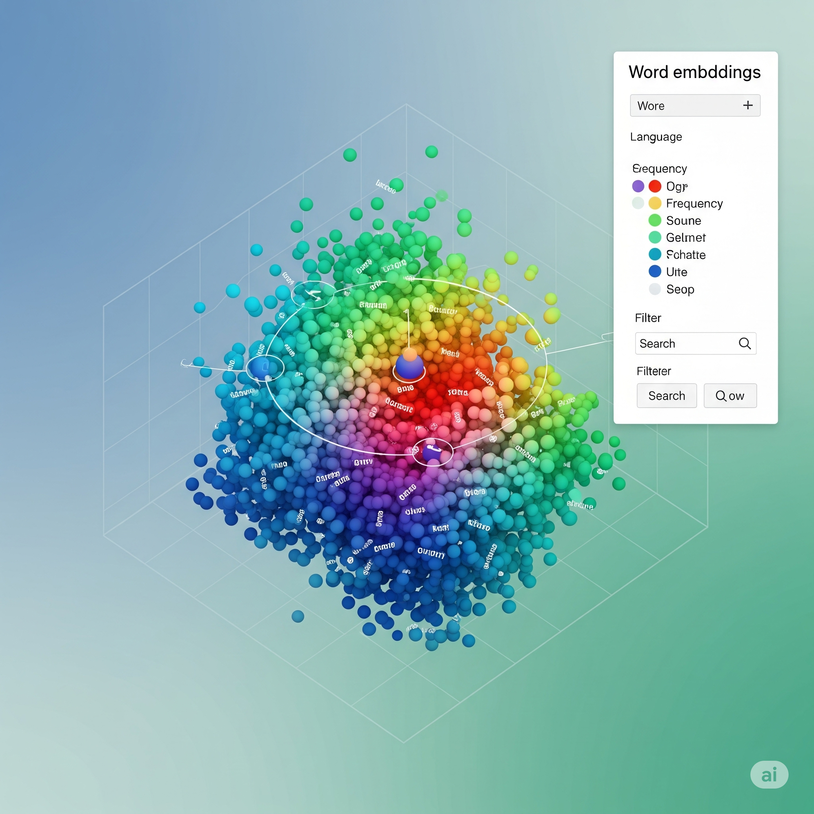
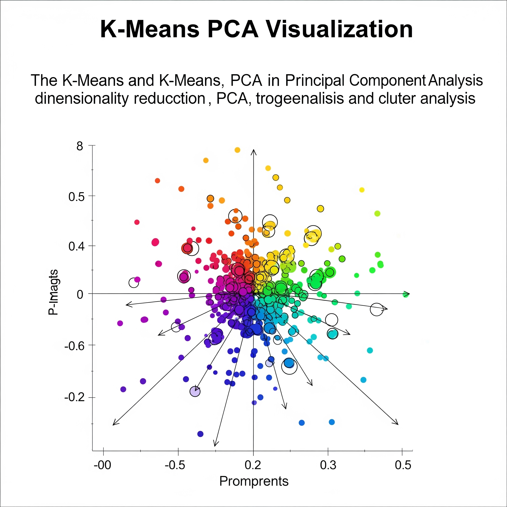

# 🚀 Lab Programs: GenAI + Machine Learning

Welcome to my **Lab Programs Repository**, featuring hands-on projects in:

- 🧠 **Generative AI**
- 📊 **Machine Learning**

This repo contains practical Python programs and Jupyter notebooks that showcase modern AI & ML techniques using real-world datasets and modern APIs.

[](https://www.python.org/)
[](https://github.com/Dev-0618/Lab-Programs/commits/main)
[](https://github.com/Dev-0618/Lab-Programs/stargazers)

## 📂 Repository Structure

```plaintext
lab-programs/
├── Gen-AI/
│   ├── 1_explore_pretrained_word_vectors.py
│   ├── 2_visualize_word_embeddings_dimensionality_reduction.py
│   ├── 3_train_custom_word2vec_domain_specific.py
│   ├── 4_enrich_prompt_with_embeddings.py
│   ├── 5_generate_sentences_from_embeddings.py
│   ├── 6_sentiment_analysis_huggingface.py
│   ├── 7_summarize_text_huggingface.py
│   └── 8_cohere_chat_example.py
├── ML-Lab/
│   ├── ML_Lab.ipynb
│   └── ML-Lab-datasets/
│       ├── auto-mpg.csv
│       ├── BostonHousing.csv
│       ├── breastcancer_modified.csv.csv
│       ├── california_housing.csv
│       ├── Filtered_Students.xlsx
│       ├── heart.csv
│       ├── housing.csv
│       ├── iris.csv
│       └── olivettifaces.mat

````

## 🧠 GenAI Program Highlights

| Program No. | Task                                                 |
| ----------- | ---------------------------------------------------- |
| 1           | Explore Pre-trained Word Vectors                     |
| 2           | Visualize Word Embeddings (Dimensionality Reduction) |
| 3           | Train Custom Word2Vec on Domain Data                 |
| 4           | Enrich Prompts with Embeddings                       |
| 5           | Generate Sentences from Embeddings                   |
| 6           | Sentiment Analysis using HuggingFace Transformers    |
| 7           | Text Summarization using HuggingFace Transformers    |
| 8           | Chat Example with Cohere API                         |

## 📊 Machine Learning Lab

| Component         | Description                                                                           |
| ----------------- | ------------------------------------------------------------------------------------- |
| **ML\_Lab.ipynb** | End-to-end ML notebook covering data preprocessing, visualization, and model training |
| **Datasets**      | 9+ diverse datasets included for ML experimentation                                   |

## ✨ Visual Sneak Peek

### 🌌 Word Embeddings Visualization



### 📈 KMeans Clusters + PCA (ML\_Lab.ipynb)



## 🚀 Getting Started

### 1️⃣ Clone the repo

```bash
git clone https://github.com/Dev-0618/Lab-Programs.git
cd Lab-Programs
```

### 2️⃣ Install dependencies

```bash
pip install -r requirements.txt
```

### 3️⃣ Run GenAI programs

```bash
cd Gen-AI
python 1_explore_pretrained_word_vectors.py
# or any other program
```

### 4️⃣ Launch ML Lab notebook

```bash
cd ML-Lab
jupyter notebook ML_Lab.ipynb
```

## 🛠 Tech Stack

* Python 3.x
* HuggingFace Transformers
* Cohere API
* Word2Vec (Gensim / custom training)
* Scikit-learn
* Pandas
* Matplotlib / Seaborn
* Jupyter Notebooks

## 🤝 Contributing

Contributions are welcome!
Feel free to fork this repo and submit pull requests to improve or extend the projects.

## ⭐️ If you find this repo useful, please consider giving it a ⭐️!

<p align="center">
  Crafted with ❤️ by [Dev-0618](https://github.com/Dev-0618)
</p>

---
